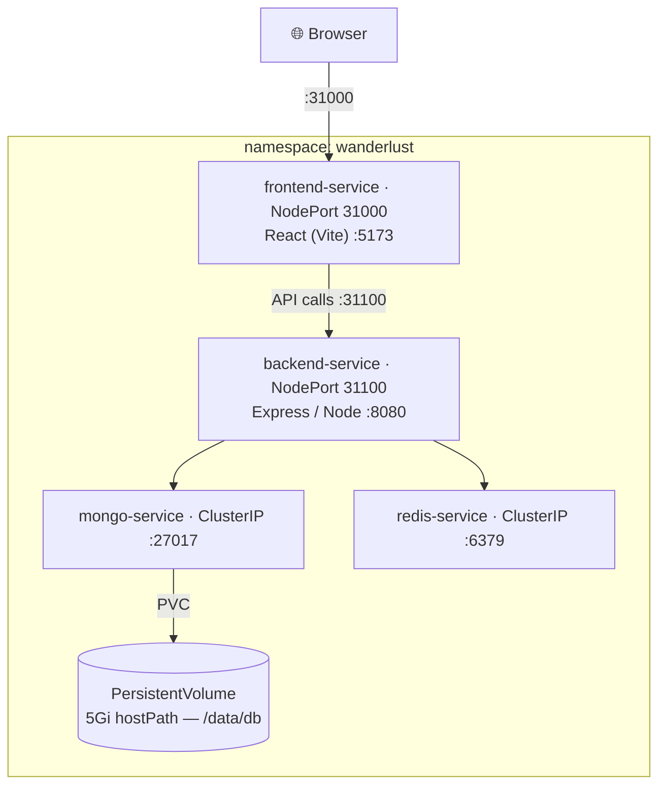

# Wanderlust — MERN Stack on a Self-Managed Kubernetes Cluster (kubeadm)

Deploying a full **MERN** application (**M**ongoDB · **E**xpress · **R**eact · **N**ode.js) together with a **Redis** cache onto a **two-node Kubernetes cluster built from scratch with `kubeadm`** — no managed control plane, every component provisioned and wired by hand.

This repository is an end-to-end DevOps deployment project: it takes the *Wanderlust* travel-blog application and runs it as a production-style, multi-tier workload on Kubernetes, with the container runtime, pod network, DNS, persistent storage, and service networking all set up manually.


---

## Architecture

Four services live in a dedicated `wanderlust` namespace. The browser reaches the React frontend and the Express API over **NodePorts**; the database and cache stay internal (**ClusterIP**); MongoDB's data is backed by a **PersistentVolume**.



| Tier | Component | Service type | Port |
|------|-----------|--------------|------|
| Presentation | React (Vite) frontend | NodePort | `31000` → `5173` |
| Application | Express / Node.js API | NodePort | `31100` → `8080` |
| Data | MongoDB | ClusterIP | `27017` |
| Cache | Redis | ClusterIP | `6379` |

---

## The cluster (built by hand)

| Piece | Choice |
|-------|--------|
| Infrastructure | 2 × AWS EC2 `t2.medium` (Ubuntu) — 1 master + 1 worker |
| Bootstrap | `kubeadm` (Kubernetes **v1.29**) |
| Container runtime | **CRI-O** |
| Pod network (CNI) | **Calico** v3.26 |
| DNS | CoreDNS (scaled across both nodes for reliable service discovery) |
| Storage | `hostPath` PersistentVolume + PersistentVolumeClaim |

Full, command-by-command cluster setup: **[`kubernetes/kubeadm.md`](kubernetes/kubeadm.md)**.

---

## Repository layout

```
.
├── kubernetes/            # ← the Kubernetes infrastructure (core of this project)
│   ├── kubeadm.md             # Build the 2-node cluster: CRI-O, kubeadm init/join, Calico
│   ├── persistentVolume.yaml  # 5Gi hostPath volume for MongoDB
│   ├── persistentVolumeClaim.yaml
│   ├── mongodb.yaml           # MongoDB Deployment + ClusterIP Service
│   ├── redis.yaml             # Redis Deployment + ClusterIP Service
│   ├── backend.yaml           # Express/Node Deployment + NodePort 31100
│   ├── frontend.yaml          # React Deployment + NodePort 31000
│   ├── README.md              # Step-by-step deployment walkthrough (with screenshots)
│   └── assets/                # Screenshots referenced by the walkthrough
├── backend/               # Express/Node.js API (Dockerfile, .env.docker)
├── frontend/              # React + Vite + TypeScript UI (Dockerfile, .env.docker)
├── docker-compose.yml     # Local (non-Kubernetes) run of the full stack
└── LICENSE                # MIT
```

---

## Deploy it yourself

> **Prerequisites:** two Ubuntu `t2.medium` EC2s (master + worker) with the master's port `6443` open between them. Build the cluster first using **[`kubernetes/kubeadm.md`](kubernetes/kubeadm.md)**.

**1 — Build & push your own images** (the manifests use `<your-dockerhub-username>` placeholders):

```bash
# from backend/ and frontend/ respectively — set the reachable IPs in each .env.docker first
docker build -t <your-dockerhub-username>/wanderlust-backend:v1 .
docker build -t <your-dockerhub-username>/wanderlust-frontend:v1 .
docker login && docker push <your-dockerhub-username>/wanderlust-backend:v1
docker push <your-dockerhub-username>/wanderlust-frontend:v1
# then update image: in kubernetes/backend.yaml and kubernetes/frontend.yaml
```

**2 — Deploy the tiers, in order** (storage → data → app):

```bash
kubectl create namespace wanderlust
kubectl config set-context --current --namespace wanderlust

cd kubernetes
kubectl apply -f persistentVolume.yaml
kubectl apply -f persistentVolumeClaim.yaml
kubectl apply -f mongodb.yaml
kubectl apply -f redis.yaml       # give Mongo + Redis 3–4 min to come up
kubectl apply -f backend.yaml
kubectl apply -f frontend.yaml
```

**3 — Open the app** at `http://<your-worker-node-public-ip>:31000/`

The detailed walkthrough with verification steps and screenshots is in **[`kubernetes/README.md`](kubernetes/README.md)**.

---

## What this project demonstrates

- Bootstrapping a Kubernetes cluster **from bare Linux servers** with `kubeadm` (control-plane init, worker join, tokens & certs)
- Installing and configuring a **container runtime (CRI-O)** and a **CNI (Calico)** by hand
- Diagnosing and fixing a real cluster issue — **CoreDNS placement / service discovery** on a small cluster
- **Multi-tier application deployment**: Deployments, Services (ClusterIP vs NodePort), namespaces
- **Persistent storage** with PersistentVolumes / PersistentVolumeClaims
- Building and shipping **Docker images** and wiring services together via environment configuration
- Understanding the trade-offs between a hand-built cluster and a managed service (e.g. Amazon EKS)

---

## License

Released under the **MIT License** — see [`LICENSE`](LICENSE). The Wanderlust application is open-source software under the same license.
